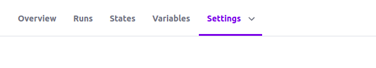

# Challenge-2

### Please ensure you have an AWS Account
[AWS]https://signin.aws.amazon.com/signin
#### create a new user with adminstrative policy
download your new user credentials


### Please ensure you have a terraform cloud account
[Terraform]https://app.terraform.io/

 * open your default browser, please use your default browser because we would need it
 to sign our cli into terraform
 * Go to terraform.io/cloud
 * create an account ...
 * when you are done, Click ==start from scratch==
 * Enter a unique organization name, we can use the email you just confirmed when creating your terraform profile. Click Create Organization
 * Please remember your organization name we would need it to set up our terraform script
 * Create a new Workspace -> select api-driven workflow ->  provide a workspace name **"plan-a-collins-vpc"** and create , please use your default browser because we would need it to later to sign our cli into terraform


* click on the Variables tab within your workspace, we are going to add keys to enable access to AWS

* click on add variable
* Enter "AWS_ACCESS_KEY_ID" as key and the values of your AWS ACCESS Key you downloaded as the value 
* click save variable
* Enter "AWS_SECRET_ACCESS_KEY" as key and the values of your AWS SECRET Key you downloaded as the value, also check the sensitive checkbox to indicate the value as sensitive
* click save variable
* Please ensure the values you are entering are valid and correct :) i want my Terraform scripts to run :)
* Click the setting tab  


* select general and enable **Share with all workspaces in this organization**


### CREATE Another Workspace, we would need it for EKS we can call it plan-a-collins-vpc-eks" with a **different workspace name** but with the same configuration as the first

clone this repo
navigate to terraform-environments/01-vpc/
open main.tf
change  the value of organization to the organization your created in Terraform cloud
to plan-a-collins-vpc or any name you gave your workspace
  ```backend "remote" {
    # Update to your Terraform Cloud organization
    organization = "klinzdemo"

    workspaces {
      name = "plan-a-job"
    }
  }
  ```

  navigate to terraform-environments/02-eks/
open main.tf
make the same changes you made on terraform-environments/01-vpc/main.tf to terraform-environments/02-eks/main.tf file

navigate back to
**terraform-environments/01-vpc/** folder
please ensure you can see the main.tf file 
open your terminal to the directory **terraform-environments/01-vpc/**

enter 
`terraform login`
you will be promted with a question to allow login
enter 
`yes`
this would open your default browser to a token
copy the token
paste it in your cli
** you may not see what you just paste *** but it's fine hit enter :)

you should be logged in if you are not please visit 
[Terraform]"https://www.terraform.io/cli/commands/login" to login


please ensure you are in this directory **terraform-environments/01-vpc/**

`terraform init`

`terraform plan`

`terraform apply`

navigate to terraform-environments/02-eks/
ensure you have changed your organization and workspace values

change the value of 
`userarn  = "arn:aws:iam::582024900488:user/spad"`

`username = "spad"`

to the value of your the user you want to have access to kubernetes cluster use this link to get you own understand how to get your own values
[AWS ARN]https://docs.aws.amazon.com/IAM/latest/UserGuide/reference_identifiers.html

enter 

`terraform init`

`terraform plan`

`terraform apply`


